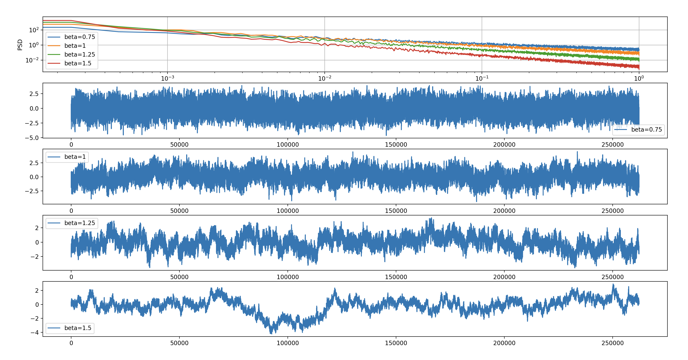

# Configuring NDS

The scripts provided with NDS are configured using a `settings.yaml` file.
By default, this file is stored in `$HOME/.nds` and created when you run the `nds_post_install_config` script.
However, you can specify custom locations by passing the `--settings_path=/path/to/settings.yaml` argument to most NDS scripts.
You can customize the behavior of the NDS components by editing the `settings.yaml` as described below.

## Encoder

The `encoder` transforms behavioral data into spike rates using a pretrained model.
It is comprised of three sub-components, the preprocessor, the encoder model, and the postprocessor.
Each of these sub-components can be configured using the `setttings.yaml` file.
Additionally, the input and output and system behavior can be configured.

### Encoder period

The time interval between encoder iterations can be configured by changing the `loop_time` configuration:

```
timer:
  loop_time: 0.02 # seconds
```

### Input

Configure one of the 2 possible behavior data input sources for the encoder.

#### Behavior LSL stream

To enable LSL as input for the encoder apply the following configuration:

```
encoder:
  input:
    type: "LSL"
```

The available settings for this input source are:

```
encoder:
  input:
    lsl:
      stream_name: "NDS-Behavior"
      # maximum time for attempting a connection to an LSL input stream
      connection_timeout: 60.0 # seconds
```

#### Prerecorded behavior file

To enable file as input for the encoder change the following configuration:

```
encoder:
  input:
    type: "file"
```

The available customizations for this input source are:

```
encoder:
  input:
    file:
      # paths can be absolute or relative to the current work directory
      path: "sample_data/session_4_behavior_standardized.npz"
      sampling_rate: 50 # Hz
      timestamps_array_name: "timestamps_train"
      data_array_name: "vel_train"
```

The `npz` file is expected to include two arrays, one with timestamps and another one with behavior data. The name of each array has to be defined in the configuration file, this information is required by the encoder in order to read the data correctly. {ref}`Export standardized model for streaming` contains an example of how to save a file in the correct format.

### Plugins

#### Preprocessor

Enable the encoder to use your custom preprocessor by changing the path:

```
encoder:
  # set a path to your custom preprocessor plugin
  preprocessor: 'plugins/preprocessor.py'
```

#### Postprocessor

Enable the encoder to use your custom postprocessor by changing the path:

```
encoder:
  # set a path to your custom postprocessor plugin
  postprocessor: 'plugins/postprocessor.py'
```

#### Model

To integrate your customized model set the following configuration:

```
encoder:
  # path to the model entrypoint
  model: 'plugins/model.py'
```

### Output

The encoder can be configured to output to a file or to an LSL stream. Each output type allows its own customization.

#### Spike rates LSL output

To enable LSL output apply the following configuration:

```
encoder:
  output:
    type: "LSL"
```

The available customizations for this output type are:

```
encoder:
  output:
    lsl:
      # possible values are "float32", "double64", "int8", "int16", "int32", "int64"
      channel_format: "int16"
      stream_name: "NDS-SpikeRates"
      stream_type: "SpikingRates"
      source_id: "SimulatedSpikeRates"
      instrument:
        manufacturer: "Hardware Company"
        model: "Simulated"
        id: 0
```

`stream_name` is the most relevant in this context as it is used by the `ephys generator` script to discover and connect to the LSL source.

#### Save spike rates to file

To set the encoder output to a file apply the following configuration:

```
encoder:
  output:
    type: "file"
```

The available customizations for this output type are:

```
encoder:
  output:
    file: "output.csv"
```

The format of the output file is CSV without header. The first column is the timestamp and the following columns are the spike rates for each unit.

## Ephys Generator

The `electrophysiology (ephys) generator` is responsible for synthesizing spikes based on input spike rate data that it receives.
The `ephys generator` produces three outputs that are continuously pushed to 3 LSL streams.
The system properties and streams can be configured using the `settings.yaml` file.
The available general customizations for `ephys generator` are:

```
ephys_generator:
  random_seed: 12332323

  resolution: 0.25 # uV per count

  raw_data_frequency: 30_000 # Hz
  n_units_per_channel: 1 # number of distinct waveforms in each channel

  refractory_time: 0.001 # seconds

  lsl_chunk_frequency: 1_000 # Hz
```

### Random seed

`random_seed` is used to initialize [NumPy's](https://numpy.org/) underlying random number generator which is useful for reproducibility between runs.

### Resolution

`resolution` is the resolution of the electrophysiology data in microvolts per count.

### Raw data frequency

`raw_data_frequency` represents the sampling rate of the raw data output. This can have an impact on the performance of the simulation. While a typical value is 30kHz, on machines with less-capable CPUs this should be lowered to 10kHz.

### Units per channel

`n_units_per_channel` defines how many neurons are being captured per channel.

### Refractory time

`refractory_time` is the minimum time between two consecutive spikes for a unit.

### LSL chuck frequency

`lsl_chunk_frequency` determines how often data is being pushed to the LSL streams.

### Input

`Ephys generator` typically consumes the output from the encoder, in which case the input type should be LSL.

#### Spike rates LSL input

To use an LSL input apply the following configuration:

```
ephys_generator:
  input:
    type: "LSL"
```

The available customizations for this input type are:

```
ephys_generator:
  input:
    lsl:
      stream_name: "NDS-SpikeRates"
      # maximum time for attempting a connection to an LSL input stream
      connection_timeout: 60.0 # seconds
```

If `ephys generator` should read the rates from the encoder via LSL, then the `stream_name` in this configuration should match the `stream_name` from the encoder [output](#spike-rates-lsl-output).

#### Testing input

Like the name suggests, this input is meant for testing. To use it, apply the following configuration:

```
ephys_generator:
  input:
    type: "testing"
```

The available customizations for this input type are:

```
ephys_generator:
  input:
    testing:
      n_channels: 50
```

When the testing input is configured, the `ephys generator` will output spikes based on constant spike rates for each channel/unit. The rates are uniformly distributed in the interval [0, 100). This means that, if `n_channels` is set to 50, the first unit will have a spike rate of 0, while the last unit will have a spike rate of 99 spikes/s.

### Output

Following are the configurations for each of the 3 LSL outputs.

#### Raw

The available customizations for this output type are:

```
ephys_generator:
  output:
    raw:
      lsl:
        # possible values are "float32", "double64", "int8", "int16", "int32", "int64"
        channel_format: "int16"
        stream_name: "NDS-RawData"
        stream_type: "Ephys"
        source_id: "SimulatedRawData"
        instrument:
          manufacturer: "Hardware Company"
          model: "Simulated"
          id: 0
```

#### LFP

The available customizations for this output type are:

```
ephys_generator:
  output:
    lfp:
      data_frequency: 1_000 # Hz
      filter_cutoff: 300 # Hz
      filter_order: 4 # number
      lsl:
        # possible values are "float32", "double64", "int8", "int16", "int32", "int64"
        channel_format: "int16"
        stream_name: "NDS-LFPData"
        stream_type: 'LFP'
        source_id: "SimulatedLFPData"
        instrument:
          manufacturer: "Hardware Company"
          model: "Simulated"
          id: 0
```

#### Spike Events

The available customizations for this output type are:

```
ephys_generator:
  output:
    spike_events:
      lsl:
        # possible values are "float32", "double64", "int8", "int16", "int32", "int64"
        channel_format: "int16"
        stream_name: "NDS-SpikeEvents"
        stream_type: "SpikeEvents"
        source_id: "SimulatedSpikeEvents"
        instrument:
          manufacturer: "Hardware Company"
          model: "Simulated"
          id: 0
```

### Noise

Noise is being generated with the help of the [colorednoise](https://github.com/felixpatzelt/colorednoise) library. The following noise characteristics can be adjusted:

```
ephys_generator:
  # Gaussian (1/f)**beta noise settings
  noise:
    # exponent
    beta: 1.5
    # noise standard deviation
    standard_deviation: 40.0
    # low-frequency cutoff. The power-spectrum below fmin is flat.
    fmin: 0.0001
    # unique noise samples to generate per channel
    # the noise is repeated if the samples are all used
    samples: 262144
```

For example here's how changing the `beta` can impact the output raw data:



### Loading custom spike waveforms

It is possible to configure the waveforms for the spikes synthesized by the `ephys generator` by adjusting the following configuration:

```
ephys_generator:
  waveforms:
    n_samples: 48
    prototypes:
      1: "[0.0, 8.5, 17.0, 24.0, 30.75, 47.75, 64.5, 72.75, 81.25, 72.75, 64.5, 28.0, -8.25, -99.25, -190.0, -194.25, -198.5, -172.0, -145.25, -95.0, -44.75, 1.5, 47.75, 68.75, 89.5, 92.5, 95.25, 82.5, 70.0, 57.5, 44.75, 29.5, 14.0, 7.0, 0.0, -2.75, -5.5, -7.0, -8.25, -4.0, 0.0]"
      2: "[0.0, -4.0, -8.25, -16.75, -25.0, -74.0, -123.0, -111.75, -100.5, 8.5, 117.5, 137.25, 156.75, 117.5, 78.5, 22.5, -33.5, -41.75, -50.25, -47.5, -44.75, -40.5, -36.25, -25.0, -14.0, -5.5, 3.0, 10.0, 17.0, 18.25, 19.75, 11.25, 3.0, -1.25, -5.5, -5.5, -5.5, -4.0, -2.75, -1.25, 0.0]"
      3: "[0.0, -5.5, -11.0, -25.0, -39.0, -95.0, -151.0, -151.0, -151.0, -99.25, -47.5, 8.5, 64.5, 106.5, 148.25, 175.0, 201.5, 169.25, 137.25, 89.5, 42.0, 22.5, 3.0, -5.5, -14.0, -16.75, -19.5, -21.0, -22.25, -22.25, -22.25, -22.25, -22.25, -21.0, -19.5, -15.25, -11.0, -9.75, -8.25, -4.0, 0.0]"


    unit_prototype_mapping:
      default: 1
      1: 3
```

A new custom waveform should be added first to the `prototypes` dictionary, where the key can be any integer serving as the prototype ID and the value is the JSON list of the waveform samples. In the next step, the `unit_prototype_mapping` dictionary should be updated to include the new prototype ID for the `unit` that is expected to use it. The `default` key is used for all `units` that are not explicitly defined in the mapping.
So in the example above, unit 1 will use waveform prototype 3, and units 0 and 2 will both use waveform prototype 1.
