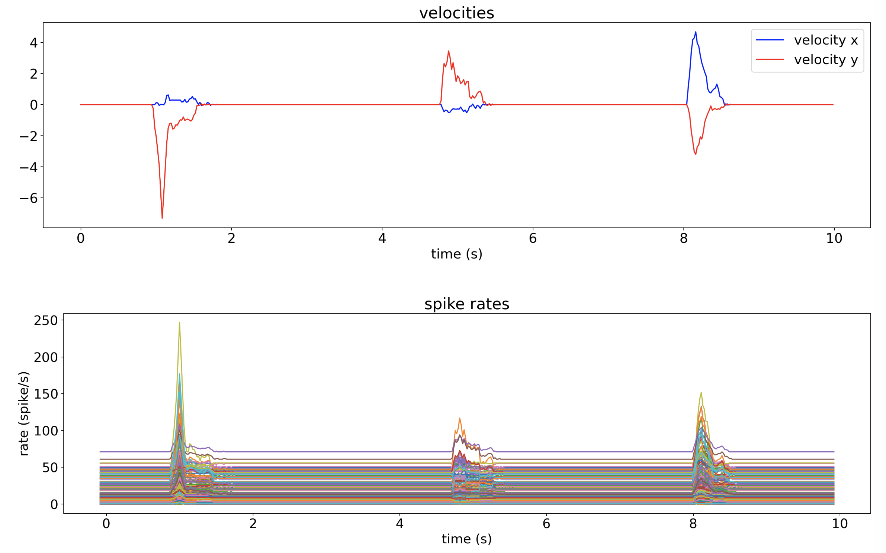

# Encoder


The encoder transforms behavioral data into spike rates using a pretrained model.
It is designed as a pipeline with three stages: the preprocessor, the encoder model, and the postprocessor.

The image below shows an example of input and output of an encoder using a pretrained model for mouse cursor movements. A varying velocity input generates a variation in spike rates for all channels.



The input to the encoder can be a [file](configuring.md#prerecorded-behavior-file) or an [LSL stream](configuring.md#behavior-lsl-stream). Similarly, the output spike rates can be saved to a [file](configuring.md#save-spike-rates-to-file) or streamed via [LSL](configuring.md#spike-rates-lsl-output).

To start the encoder, complete the [installation](installation.md), adjust the [configuration](configuring.md#encoder), then run the script:

```
encoder
```

## Customizing the Encoder

### Plugins

Plugins are simple ways to change or extend how the [encoder](encoder.md) works. All stages of the [encoder](encoder.md) pipeline can be customized using plugins. The `preprocessor` and `postprocessor` are optional, where the encoder `model` plugin is required.

Plugins have several usages depending on which component is being plugged in.

The `preprocessor` plugin (via its implementation of the [Processor](nds.encoder.Processor) protocol) is used to change the data before entering the encoder `model` (i.e. it modifies the behavior data); for example, it can be defined to scale behavioral data to accepted range, change behavioral data format, filter behavior data, add noise/disturbances to behavior data, etc.

The encoder `model` plugin (via its implementation of the [EncoderModel](nds.models.EncoderModel) protocol) is used to define the model that converts behavior data to firing rate data.

Finally, the `postprocessor` plugin (via its implementation of the [Processor](nds.encoder.Processor) protocol) is used to change the data after passing through the encoder `model` (i.e. it modifies the spiking rate data); for example change dimensionality of the model output data (e.g. duplicate or remove channels), add noise to firing rate data, swap channels or zero out channels to simulate data disturbances, etc.

### Preprocessor

A `preprocessor` is responsible for transforming the behavior input data before it is sent to the model. It should modify the received behavioral data to the encoder's expected shape (i.e., same number of channels) and scaling. For example, the default encoder expects standardized inputs with mean of 0 and standard deviation of 1.

You can find examples of the preprocessor in the [plugins example folder](https://github.com/agencyenterprise/neural-data-simulator/tree/main/src/plugins/examples). To create and configure a preprocessor from scratch, check out the [Example custom preprocessor as plugin](#example-custom-preprocessor-as-plugin).

### Encoder model

The encoder `model` is responsible for converting preprocessed behavior data into spike rates.

```{important}
An encoder `model` plugin is **required** for running NDS.
```

#### Default model

NDS includes a default model called [VelocityTuningCurvesModel](https://github.com/agencyenterprise/neural-data-simulator/blob/main/src/plugins/examples/model.py). The example [Train models for the encoder and decoder](auto_examples/plot_train_encoder_and_decoder_model) illustrates the steps performed for training the parameters of the included model.
You can modify this example to create a model that suits the needs of your project.

#### Custom model

You can easily add a new model to NDS by implementing a plugin. Check out [Creating a new model plugin for the encoder](#creating-a-new-model-plugin-for-the-encoder) to get started.

```{note}
When adding a new model to the encoder, ensure that the input data has the same dimensionality and type as the input data used to train the model.
```

### Postprocessor

The `postprocessor` modifies the encoder output into a format that the [`ephys generator`](ephys_generator.md) will expect.

You can find an example of a postprocessor in the [plugins example folder](https://github.com/agencyenterprise/neural-data-simulator/tree/main/src/plugins/examples). To create and configure a postprocessor from scratch, check out the [Example custom postprocessor as plugin](#example-custom-postprocessor-as-plugin).

### Example custom preprocessor as plugin

Create a python script file in any location you prefer, for example `preprocessor.py`.
At a minimum, this script should define a function called `create_preprocessor` that returns an instance of a class that implements the [Processor](nds.encoder.Processor) protocol.

The following snippet is a minimal but complete example of a preprocessor that just passes through the data unchanged as it receives it:

```
"""An example preprocessor"""
from nds.encoder import Processor
from nds.samples import Samples


class PassThroughPreprocessor(Processor):
    def execute(self, data: Samples) -> Samples:
        # Process the data and return the transformation.
        return data

def create_preprocessor() -> Processor:
    return PassThroughPreprocessor()
```

Your implementation of the `execute` function will be called by NDS with the data that you should transform and return.

To make NDS call your preprocessor, you have to add the path of the script you just created to the encoder [configuration](configuring.md#preprocessor). Upon start the encoder will expect to obtain an instance of the preprocessor by calling the `create_preprocessor` function.

### Example custom postprocessor as plugin

Create a python script file in any location you prefer, for example `postprocessor.py`.
At a minimum, this script should define a function called `create_postprocessor` that returns an instance of a class that implements the [Processor](nds.encoder.Processor) protocol.

The following snippet is a minimal, but complete example of a postprocessor that just passes through the data unchanged as it receives it:

```
"""An example postprocessor"""
from nds.encoder import Processor
from nds.samples import Samples


class PassThroughPostprocessor(Processor):
    def execute(self, data: Samples) -> Samples:
        # Process the data and return the transformation.
        return data

def create_postprocessor() -> Processor:
    return PassThroughPostprocessor()
```

Your implementation of the `execute` function will be called by NDS with the data that you should transform and return.

To make NDS call your postprocessor, you have to add the path of the script you just created to the encoder [configuration](configuring.md#postprocessor). Upon start the encoder will expect to obtain an instance of the postprocessor by calling the `create_postprocessor` function.

### Creating a new model plugin for the encoder

If the included example [VelocityTuningCurvesModel](https://github.com/agencyenterprise/neural-data-simulator/blob/main/src/plugins/examples/model.py) is not well suited for your use case and [retraining this model](auto_examples/plot_train_encoder_and_decoder_model) is not a good option, you can create your own model and integrate it into the NDS encoder as a plugin.

Create a python script file in any location you prefer, for example `model.py`.
At a minimum, this script should define a function called `create_model` that returns an instance of a class that implements the [EncoderModel](nds.models.EncoderModel) protocol.

The following snippet is an example of a model that returns random values for spike rates:

```
"""Example of a custom EncoderModel."""
from nds.models import EncoderModel
from nds.samples import Samples

class ExampleModel(EncoderModel):
    """ExampleModel implementation."""

    def encode(self, X: Samples) -> Samples:
        """Perform the encode and return the result."""
        return Samples(
            timestamps=X.timestamps, data=np.random.rand(X.timestamps.shape[0], 190)
        )

def create_model() -> EncoderModel:
    """Instantiate the ExampleModel."""
    return ExampleModel()
```

The encoder will expect to obtain an instance of the model from the `create_model` function. The `encode` function will be called periodically by the encoder with the data that you should evaluate and return. The period can be changed in the [configuration](configuring.md#encoder-period). The data is an instance of [Samples](nds.samples.Samples) and its size depends on the sampling rate of the encoder input and the configured period. For example, if the encoder period is `0.02` seconds and the input sampling rate is `1000 Hz`, then `len(X)` will be equal to `20` on average. You should return exactly the same number of samples as you received since the encoder advertised output sampling rate is the same as the input sampling rate.

To make NDS use your new model change the [configuration](configuring.md#model) adding the path of the script you just created so that the encoder can load it.
