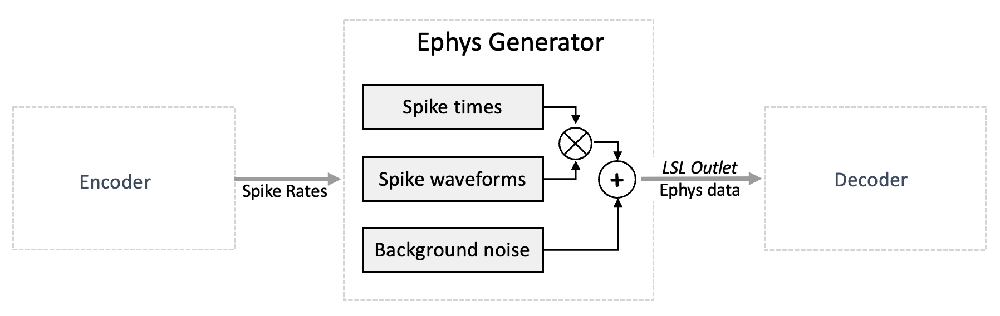
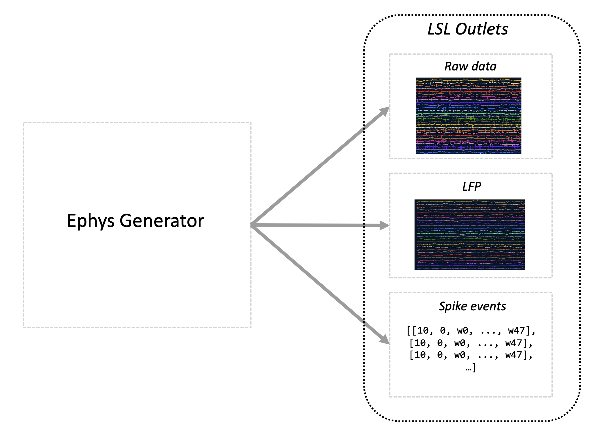
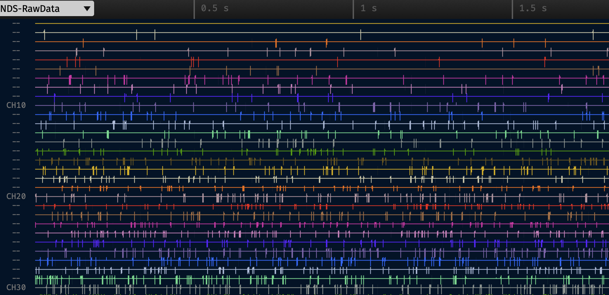

# Electrophysiology (Ephys) Generator


The electrophysiology (ephys) generator is responsible for synthesizing spikes based on input spike rate data that it receives.
The spike rate data is specified in spikes/second.

The `ephys generator` is executed periodically to approximately match the configured output rate (`lsl_chunk_frequency`), and the number of samples generated per execution is calculated to match the configured raw data frequency (`raw_data_frequency`).

NDS uses a probabilistic model, therefore over a long time span the generated spikes will match the desired spike rate.
But over short time spans there will be variation in the produced spikes per second.

The electrophysiology data is generated by convolving spike waveforms with the spiking events, and adding noise.
The spike waveforms can be specified per channel, where a channel represents the readings of the activity from one of the electrodes in the microelectrode array.

## Spike times

Spike times are calculated using the spike rate input for each channel. When there are multiple units in a channel, the rate is divided equally across the units. A unit represents a putatively isolated neuron, perhaps among several neurons, recorded from a single channel.

Each time the `ephys generator` is executed, the chances of a spike for each sample in each unit is calculated. A random draw is performed for each samples for each unit and a spike is assigned or not depending on the spike chance. An iterative process is then performed to remove spikes within the configured refractory period.

See [Ephys generator](configuring.md#ephys-generator) configuration for details.

## Spike waveforms

A list of waveform prototypes can be configured, and a waveform assigned to all units or individually mapped to each unit. For each unit, a random number between 0.5 and 1 is used to scale the waveform (the same scalar is used for an entire NDS execution).
The waveforms are added to the raw data at the spike times, where the first sample of the waveform aligns with the spike time.

See [Loading custom spike waveform](configuring.md#loading-custom-spike-waveforms) configuration for details.

## Background noise

Background noise is calculated using a gaussian distributed noise. The power law for the noise generation is configurable as well as the standard deviation of the noise. Currently, the noise for each channel is generated when starting NDS and samples are fetched as needed during execution, and restarted when all generated noise was used. The number of noise samples generated are also configurable and recommended to be large compared to the raw data frequency so the noise repetition is not noticeable.

See [Noise](configuring.md#noise) configuration for details.

## Data output

`Ephys generator` produces three outputs that are continuously pushed to 3 [configurable](configuring.md#output-1) LSL streams:



1. `raw data`: the simulated electrophysiology signal. The number of channels is the same as the number of input spike rate channels. The output signal is obtained by combining preconfigured spike waveforms with randomly generated noise. A chunk of data, which is a group of samples in chronological order, is generated on each execution of the `ephys generator`. The size of chunk depends on the [raw_data_frequency](configuring.md#ephys-generator), [lsl_chunk_frequency](configuring.md#ephys-generator) and the CPU. Ideally the chunk size is equal to {math}`\frac{raw\_data\_frequency}{lsl\_chunk\_frequency}`, but it can increase in size if the CPU is not able to keep up with the simulation. A configurable refractory period is used to ensure realistic signal generation.
2. `LFP`: the data resulted after filtering the raw data with a [configurable](configuring.md#lfp) low pass filter.
3. `spike events`: data about the generated spikes. Each sample sent through this stream is structured as follows:

   - the first element is the channel index with the spike
   - the second element is the index of the unit within the channel
   - the remaining elements carry the spike waveform

   For example if the spike waveform had 48 samples and the unit 0 spiked which was recorded on channel 10, the sample would be sent as: `[10, 0, w0, ..., w47]`.

To start the `ephys generator`, complete the [installation](installation.md), adjust the [configuration](configuring.md#ephys-generator), then run the script:

```
ephys_generator
```

To use a specific config file, specify the config directory (`--config-dir`) and config file-name (`--config-name`) flags. For example:

```
ephys_generator --config-dir $HOME/.nds/ --config-name settings
```

```{note}
By default, the `ephys generator` expects to read data from an LSL stream and output to an LSL outlet. In absence of the input stream, the `ephys generator` will not be able to start, therefore make sure to start the encoder before the `ephys generator`.
```

## Testing

You can also use the `ephys generator` in `testing` mode which produces a constant spike rates on each unit, proportional to the unit number as shown in the image below (the image is generated using the [open-ephys software](visualization.md)).



To enable the `testing` mode set this [configuration](configuring.md#testing-input).
