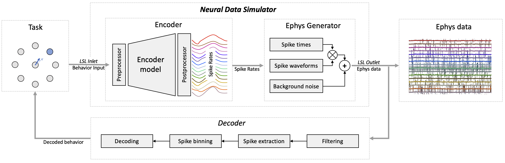

# Neural Data Simulator

The `Neural Data Simulator` (NDS) is an open source Python package designed to simplify the development of Brain-Computer Interfaces (BCIs). NDS generates real-time electrophysiology data from behavioral data, such as cursor movement and arm kinematics, to replace the BCI-user in the loop during development. The package is highly flexible and fully customizable, and comes with a set of utilities and examples which allow for the rapid kickstarting of BCI development.

Some of the key benefits of utilizing NDS are:

- It offers an affordable and efficient solution for testing a Brain-Computer Interface (BCI) in a closed-loop manner, eliminating the need for costly equipment or an actual BCI user during data collection

- The generated data mimics the temporal and frequency content of data from intracortical arrays, facilitating complete BCI pipeline testing

- Custom noise can be incorporated into the data to mimic diminishing electrophysiology data quality

- Users have the flexibility to introduce disturbances to the behavior and/or neural data, simulating a decline in data quality and change in data content over time

- It provides great flexibility, enabling the quick exchange of encoding models to represent different BCI users


The example above showcases NDS and the plugin system in a real-time closed-loop demo of a center-out reaching task. First, we capture the user's intended mouse movement (top-right figure and gray dot in main window) and use it to generate spiking rates through NDS's `encoder` module (using a model trained on real data from non-human primates performing a similar task — check out [Train models for the encoder and decoder](auto_examples/plot_train_encoder_and_decoder_model) for more information). From these spiking rates, the NDS `ephys generator` module simulates electrophysiological data (middle-right figure) in a similar format to that produced by real devices. This simulated neural data is subsequently processed and decoded, then fed back as the actual user movement (bottom-right figure and blue dot in main window), completing the closed loop. The diagram below summarizes the system architecture. For more details see the [NDS architecture](architecture.md) section.

{ width=1000 }

Try it out yourself by following our [quick start](running_bci.md) guide!

```{toctree}
:hidden:
:caption: 'Introduction'
:maxdepth: 3

installation
Quick Start <running_bci>


```

```{toctree}
:hidden:
:caption: 'Neural Data Simulator'
:maxdepth: 3

architecture
inputs
encoder
ephys_generator
configuring
running
```

```{toctree}
:hidden:
:caption: 'Extensions'
:maxdepth: 3

extending
decoders
tasks
visualization
utilities
```

```{toctree}
:hidden:
:caption: 'Tutorials'
:maxdepth: 3

auto_examples/index
```

```{toctree}
:hidden:
:caption: 'Appendix'
:maxdepth: 3

contributing
GitHub Repository <https://github.com/agencyenterprise/neural-data-simulator/>
```

```{toctree}
:hidden:
:caption: 'API Reference'
:maxdepth: 3

neural_data_simulator/modules
tools/modules
```
