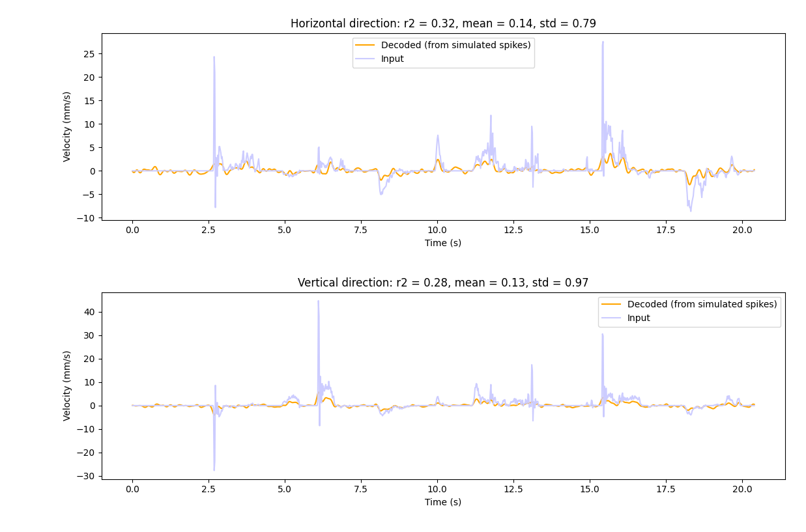

# Tasks

A tasks is a way to the user to interact with the system and it can be very general in the BCI context and in NDS.
Generally, it will present a user with a goal to achieve and give feedback on the user performance/results. In a speech decoding task, for example, it could show text prompts that it expects the user to speak and then present the result after the full NDS/BCI pipeline (i.e. all the steps to encode behavior data into neural data and back into behavior data).

In some approaches, the task will be responsible both for taking user input, converting it into behavior and also presenting the decoded behavior (i.e. the center-out reaching task example provided, that intercepts mouse movement, calculates velocity, sends it into the BCI loop, and presents the decoded behavior instead of the user original input); in others, this can be split into more applications (for example a speech decoding task, where microphone signal could be captured by one application and sent to the BCI loop as input behavior data, where a separate task prompts the user with the expected text to read and presents the decoded text).

## Provided task

The task provided with NDS is a center-out reaching task. This is a modified implementation of the task described in the paper [Structure and variability of delay activity in premotor cortex](https://journals.plos.org/ploscompbiol/article?id=10.1371/journal.pcbi.1006808) by Even-Chen et al. 

In this task, the participant is instructed to reach from a starting position towards a target, which is located either on the center of the screen or on a radial pattern from the center. They must move to the target and stay within the target for a short period. Outer and center targets alternate until the participant decides to stop. The number of outer target locations is fixed and their order of appearance is randomized.

The [`pygame`](https://www.pygame.org/) application takes input through LSL of the decoded behavior data (which represents cursor velocity) that updates the main cursor position used  to reach targets and complete the task. The application also output the behavior data through LSL, which is obtained by intercepting cursor velocity when the user moves the mouse attempting to reach the target. The display of the real input cursor position can be toggled on or off by the user, but it cannot be used to complete the task of reaching the targets.

### Using the GUI

As described above, the GUI keeps track of 2 cursors: the real cursor that is controlled by the user, and the decoded cursor that is controlled by the output of the decoder. The decoded cursor velocity is read from an LSL stream. If the stream cannot be found, the GUI will not be able to start, therefore make sure that a decoder is running before starting the GUI.

To start the GUI, complete the [installation](installation.md), then run the script:

```
center_out_reach
```

To customize the GUI, change the configuration file `settings_center_out_reach.yaml`, which is located by default in the `$HOME/.nds/` folder. You can point the script to use a different configuration file by passing the `--config-dir` and `--config-name` flags:

```
center_out_reach --config-dir $HOME/.nds/ --config-name settings_center_out_reach
```

The GUI responds to the following key presses:

1. `c` will hide the mouse cursor and leave only the decoded cursor visible.
2. `k` will start a fresh recording of data used to show the velocities and trajectories plots after the task is finished.
3. `space` will reset the position of both cursors to the center of the screen.
4. `esc` closes the GUI.

By default, the GUI is configured to collect metrics of the task. When the user presses `esc` to close the GUI the following screen is displayed:



The image above shows the coefficient of determination ({math}`r^2`) between the user input values and the decoded values, for the vertical and horizontal directions.

When the user closes the above screen, the cursor trajectories are displayed:


The dashed lines represent the user input trajectories, whereas the unbroken lines represent the decoded trajectories.

### Running without a decoder

If you want to run the center-out reach task in open loop (without the cursor velocities from the decoder), change the following configuration:

```
center_out_reach:
  input:
    enabled: false
```

## Implementing your own task

Following is a simple implementation of a task, implemented as a python script that sends data to the NDS encoder and reads the data from the decoder.
To keep it simple, the behavior data is randomly generated.
However, this demonstrates the framework required for creating your own BCI task.
See below for a complete example of a center-out task.

```
import time

import numpy as np
import pylsl


def get_lsl_outlet():
    stream_info = pylsl.StreamInfo(
        name="NDS-Behavior",
        type="behavior",
        channel_count=2,
        nominal_srate=50,
        channel_format="float32",
        source_id="centerout_behavior",
    )
    channels_info = stream_info.desc().append_child("channels")
    for ch_name in ["vel_x", "vel_y"]:
        ch = channels_info.append_child("channel")
        ch.append_child_value("label", ch_name)

    return pylsl.StreamOutlet(stream_info)


def get_lsl_inlet():
    stream_infos = pylsl.resolve_byprop("name", "NDS-Decoder")
    if len(stream_infos) > 0:
        return pylsl.StreamInlet(stream_infos[0])
    else:
        raise ConnectionError("Inlet could not find requested LSL stream.")


def main():
    loop_interval = 20 * 1e6  # nanoseconds

    lsl_outlet = get_lsl_outlet()
    lsl_inlet = get_lsl_inlet()
    last_run_time = time.perf_counter_ns()

    while True:
        time_now = time.perf_counter_ns()
        elapsed_time_ns = time_now - last_run_time
        if elapsed_time_ns >= loop_interval:
            samples, _ = lsl_inlet.pull_chunk()
            if len(samples) > 0:
                print('Decoded: ', np.array(samples), '\n')
                behavior = np.random.random((2,)) * [-5, 5]
                print('Behavior: ', np.array(samples))
                lsl_outlet.push_sample(behavior)
            last_run_time = time_now

        else:
            time.sleep(0.0001)


if __name__ == "__main__":
    main()
```

```{note}
When integrating this script into the loop, ensure that the default GUI is not running in order to prevent an LSL outlet name conflict. To achieve this change the `run-closed-loop` Makefile target removing the `poetry run center_out_reach` command.
```
