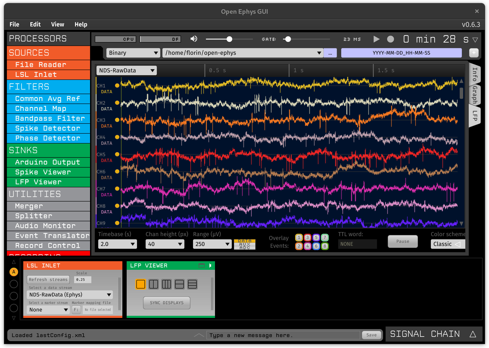

# Visualizing Data

You can plot the electrophysiology data using the [open-ephys GUI](https://open-ephys.org/gui) and the [LSL plugin](https://open-ephys.github.io/gui-docs/User-Manual/Plugins/LSL-Inlet.html). When using this plugin make sure to select the `NDS-RawData` stream and set the `scale` to `0.25` (or your own configured [resolution](configuring.md#resolution)) to convert the data from counts to microvolts. The signal chain could be as simple as the one depicted below:

